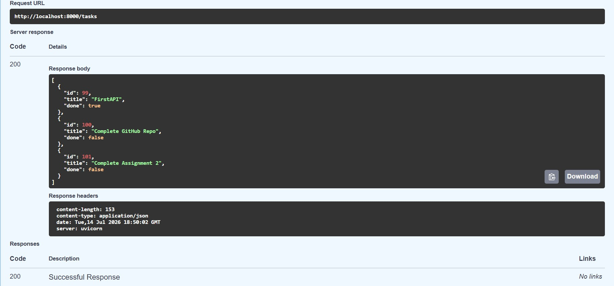
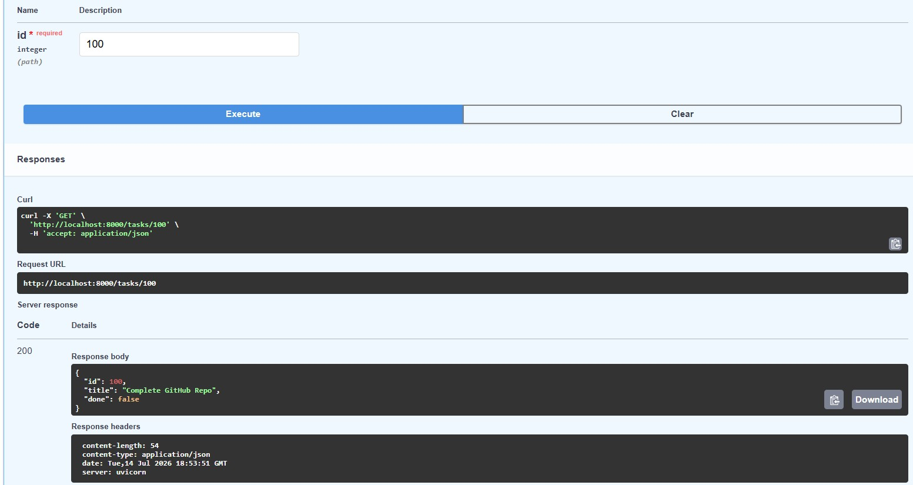
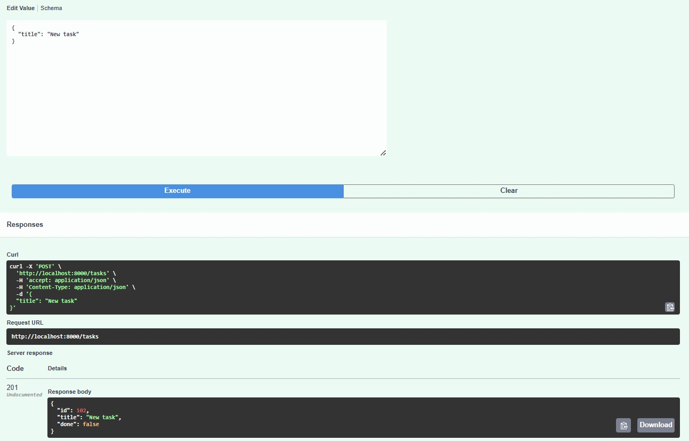
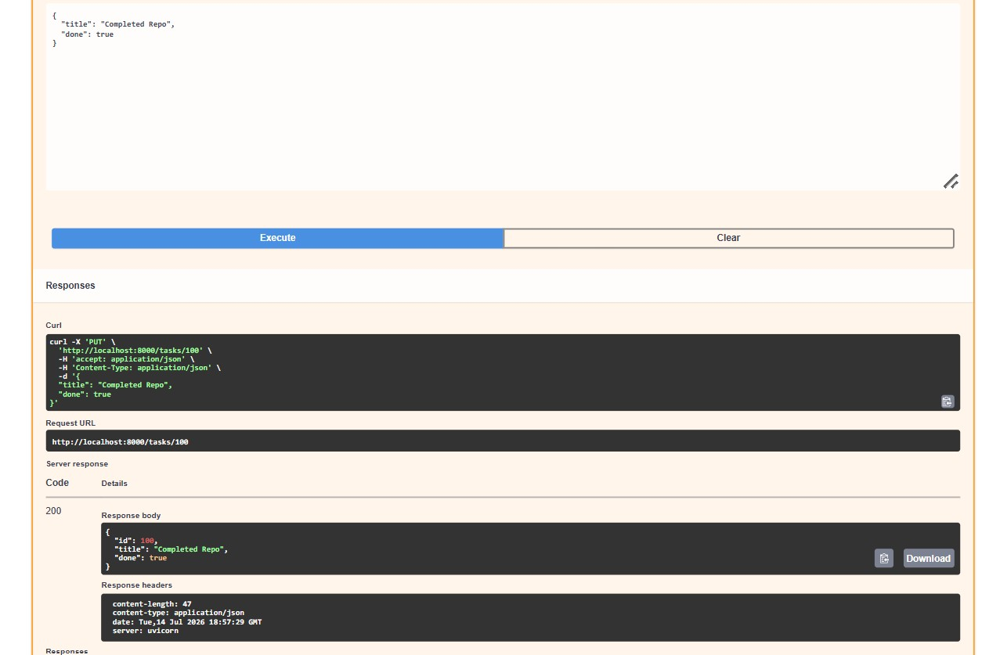
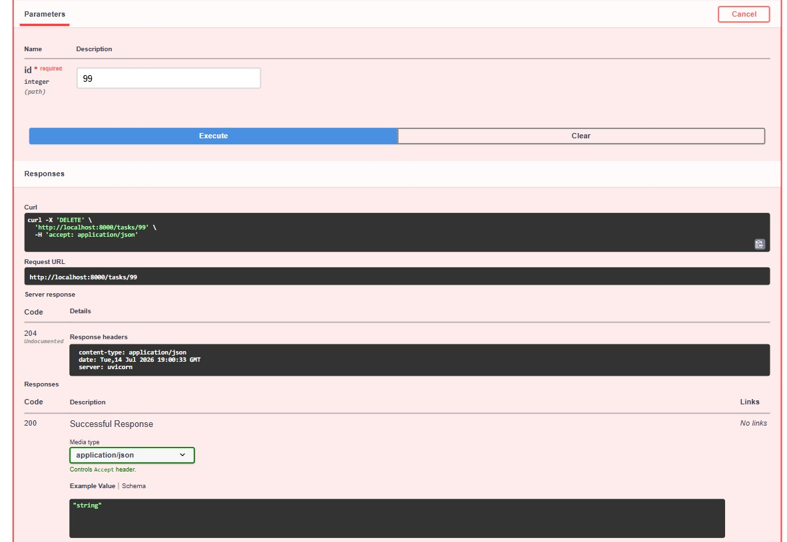

# Task API

A CRUD REST API for managing a to-do list, built with FastAPI. Data is stored in memory — no database yet, that's Week 3.

## Getting Started

```bash
# Create and activate a virtual environment
python -m venv venv
venv\Scripts\Activate.ps1

# Install dependencies
pip install fastapi uvicorn

# Run the server
uvicorn main:app --reload --port 8000
```

The API is now running at `http://localhost:8000`. Interactive docs are at `http://localhost:8000/docs`.

## Endpoints

| Method | Path | Description |
|---|---|---|
| GET | / | API info |
| GET | /health | Health check |
| GET | /tasks | List all tasks |
| GET | /tasks/{id} | Get one task |
| POST | /tasks | Create a task |
| PUT | /tasks/{id} | Update a task's title and/or done status |
| DELETE | /tasks/{id} | Delete a task |

## Example Request

```
curl -i -X POST http://localhost:8000/tasks -H "Content-Type: application/json" -d "{\"title\": \"Buy milk\"}"

HTTP/1.1 201 Created
content-type: application/json

{"id":102,"title":"Buy milk","done":false}
```

## Swagger UI







## Notes

Tasks are stored in a plain Python list in memory. Restarting the server clears everything created, updated, or deleted during that session — the list resets to its 3 hardcoded default tasks. This is expected, and it's the reason a real database is introduced in Week 3.
